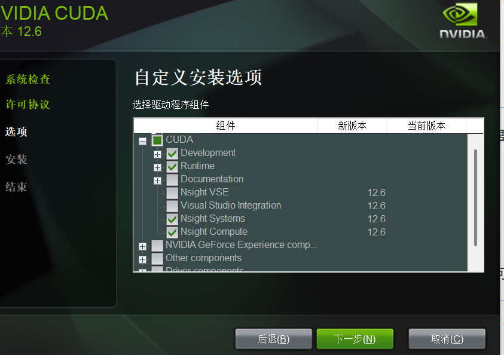

# CUDA 学习笔记

## 环境
*我使用windows,RTX4070
*我没有采用Visual Studio的开发环境，如果用VS一些步骤会不同
*如果已经装过CUDA，要卸载，请去查一下相关教程（需要删好几个东西）
*我Nvidia驱动似乎是电脑自带的，如果一开始查询驱动有问题可以去搜一下安装驱动教程

硬件的话就是有Nvidia显卡
配置需要 
### 1.查看Nvidia 驱动 ，可以通过nvidia-smi去查询当前的驱动版本
```
nvidia-smi
Mon Nov  3 21:31:37 2025
+-----------------------------------------------------------------------------------------+
| NVIDIA-SMI 566.26                 Driver Version: 566.26         CUDA Version: 12.7     |
|-----------------------------------------+------------------------+----------------------+
```
### 2.安装msvc
虽然我不使用VS，但是cuda编译依赖于MSVC，因此，还是需要打开VS官网下载VS 2022生成工具 、
下载后可以在VS installer里打开生成工具或者直接搜索打开x86_x64 Cross Tools Command 
```
**********************************************************************
** Visual Studio 2022 Developer Command Prompt v17.14.19
** Copyright (c) 2025 Microsoft Corporation
**********************************************************************
[vcvarsall.bat] Environment initialized for: 'x86_x64'

C:\Program Files\Microsoft Visual Studio\2022\Community>cl.exe
用于 x64 的 Microsoft (R) C/C++ 优化编译器 19.44.35219 版
版权所有(C) Microsoft Corporation。保留所有权利。

用法: cl [ 选项... ] 文件名... [ /link 链接选项... ]
```
输入"cl.exe"，发现能输出编译器的介绍。
注意，之后的cmd操作都是指在这个命令行而非系统本身的cmd里进行（当然，其实VS的生成工具本质上是增加了一些额外的启动环境配置脚本，要把其移植到本身的cmd应该也是可以的）
另外：https://sourceforge.net/projects/gnuwin32/ 建议去这里下载GNUwindows并把安装后的bin文件目录添加到环境变量，会对命令行操作有很大帮助。
### 3.去 https://developer.nvidia.com/cuda-toolkit 下载 cuda-toolkit
这一步有比较多的点需要注意：
a.如果网不好建议下载exe(local)版本
b.一定要注意，下载的CUDA version不要直接去下载最新的！不要超过上面命令里显示的你的CUDA Version（等于低于）
c.运行下载下来的cuda安装程序时，不要选择“精简”，点击自定义，我自己当时安装时只选择了如下几项（换言之，如果已经有驱动，geforce等东西/不用VS，就很多项没有必要装，但如果缺乏相关东西或者用VS的话，应该是需要多装的,可以去控制面板---卸载程序里确定自己有没有相关的如Geforce）：



都完成后，去command里验证nvcc
```
nvcc --version
nvcc: NVIDIA (R) Cuda compiler driver
Copyright (c) 2005-2024 NVIDIA Corporation
Built on Wed_Oct_30_01:18:48_Pacific_Daylight_Time_2024
Cuda compilation tools, release 12.6, V12.6.85
Build cuda_12.6.r12.6/compiler.35059454_0
```

如果有，就代表成功了
再提醒一遍——一定要注意，下载的CUDA version不要直接去下载最新的！不要超过上面smi命令结果里显示的你的CUDA Version（等于低于）

### 4.vscode编写
可以通过vscode作为编辑器，除了C/C++等相关扩展外
还安装vscode-cudacpp和Nsight Visual Studio Code扩展，使得代码看得比较清晰

### 5.运行示例
打开command（注意是2里说到的command）
创建vector_add.cu
```
#include <stdio.h>
#include <cuda_runtime.h>

// Very small example: launch 10 threads, each computes 1+1 and prints the result.
__global__ void simpleAdd()
{
    int id = blockIdx.x * blockDim.x + threadIdx.x;
    printf("Thread %d: 1 + 1 = %d\n", id, 1 + 1);
}

int main()
{
    printf("Hello from CPU\n");

    // Launch 1 block of 10 threads
    simpleAdd<<<1, 10>>>();

    // Wait for GPU to finish 
    cudaDeviceSynchronize();

    printf("Back to CPU\n");
    return 0;
}
```

```
E:\GPULearn>nvcc vector_add.cu -o vector_add.exe
vector_add.cu
tmpxft_0000978c_00000000-10_vector_add.cudafe1.cpp
  正在创建库 vector_add.lib 和对象 vector_add.exp

E:\GPULearn>vector_add.exe
Hello from CPU
Thread 0: 1 + 1 = 2
Thread 1: 1 + 1 = 2
Thread 2: 1 + 1 = 2
Thread 3: 1 + 1 = 2
Thread 4: 1 + 1 = 2
Thread 5: 1 + 1 = 2
Thread 6: 1 + 1 = 2
Thread 7: 1 + 1 = 2
Thread 8: 1 + 1 = 2
Thread 9: 1 + 1 = 2
Back to CPU
```
```

vector_add.exe
Hello from CPU
Thread 0: 1 + 1 = 2
Thread 1: 1 + 1 = 2
Thread 2: 1 + 1 = 2
Thread 3: 1 + 1 = 2
Thread 4: 1 + 1 = 2
Thread 5: 1 + 1 = 2
Thread 6: 1 + 1 = 2
Thread 7: 1 + 1 = 2
Thread 8: 1 + 1 = 2
Thread 9: 1 + 1 = 2
Back to CPU
```